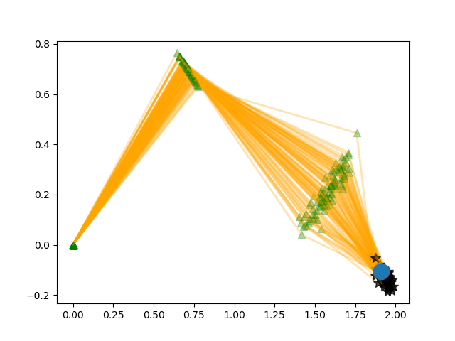

# gmm-ik
Implements expectation maximization to train a Gaussian Mixture Model that learns the inverse kinematics of a three-link manipulator.

* This is a Julia implementation of the example provided in 
Ghahramani, "Solving Inverse Problems Using an EM Approach To Density Estimation."

* In this example 1001 data points have been generated and 60 Gaussian
  distributions are used in a Gaussian mixture model to represent the inverse
  kinematics.

* In the figure below, the blue dot is a test point.
  - The posterior conditional distribution P(θ | x) is computed using from the
    learned joint probability distribution P(x, θ).
  - P(θ | x) is then sampled to generate the configuration of each link (in
    orange). The end-effector locations that result from this configuration are
    plotted by black stars.
  - The green triangles depict the locations of the revolute joints.
  
