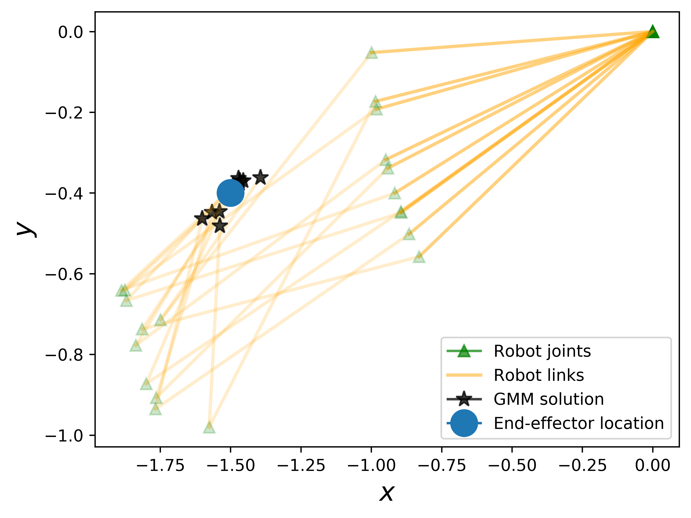

# Inverse Kinematics via Gaussian Mixture Modeling
Implements expectation maximization to train a Gaussian Mixture Model that
learns the inverse kinematics of a three-link manipulator.

I have compiled a detailed write-up on this problem that can be accessed
[here](./TeX/root.pdf) (if the first page is blank, just click "Download" on the
top right of the page).

### FULL DISCLOSURE: PROOF-OF-CONCEPT CODE -- CAN RUN VERY SLOWLY!


* This is a Julia implementation of the example provided in 
Ghahramani, "Solving Inverse Problems Using an EM Approach To Density Estimation."

* In this example 1001 data points have been generated and 61 Gaussian
  distributions are used in a Gaussian mixture model to represent the inverse
  kinematics.

* In the figure below, the blue dot is a test point.
  - The posterior conditional distribution P(θ | x) is computed using from the
    learned joint probability distribution P(x, θ).
  - P(θ | x) is then sampled to generate the configuration of each link (in
    orange). The end-effector locations that result from this configuration are
    plotted by black stars.
  - The green triangles depict the locations of the revolute joints.
  


* Example usage:
  - ```julia --project=.```
  - ```include("three_link.jl")```
  - ```r = ThreeLink(N=1001, M=61)``` -- Constructs the mechanism and the GMM
    structure.
  - ```execute_em!(r; maxiter=100)``` -- It takes around 20 iterations to
    converge to the specified (hard-coded) tolerance values.
  - ```generate_cartesian_distribution(r, nPoints=100)``` -- Generates test
    point and plots the estimation.


* The posterior distribution over θ1 and θ2 given x = [-1.5, -0.4] marginalized
  over θ3 for visualization purposes may be seen below

