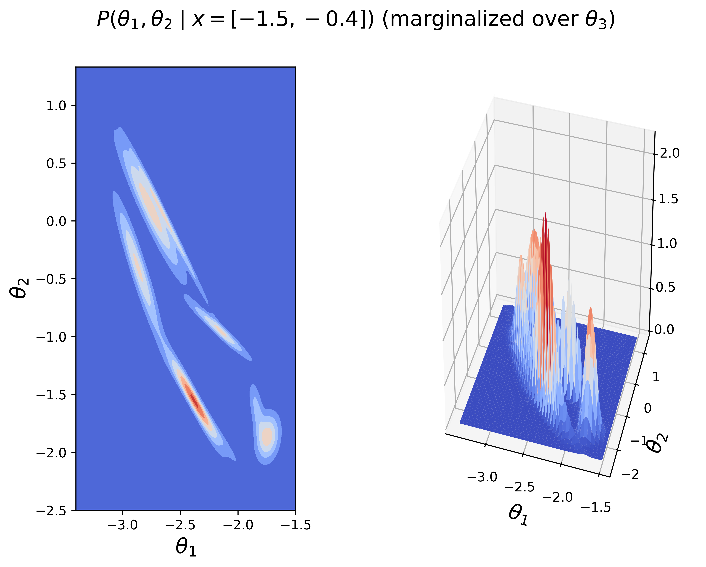

# Inverse Kinematics via Gaussian Mixture Modeling
Implements expectation maximization to train a Gaussian Mixture Model that
learns the inverse kinematics of a three-link manipulator.

I have compiled a detailed write-up on this problem that can be accessed
[here](./TeX/root.pdf) (if the first page is blank, just click "Download" on the
top right of the page).

* Example usage:
  - ```julia --project=.```
  - ```include("three_link.jl");```
  - ```r = ThreeLink(N=1001, M=61);``` -- Constructs the mechanism and the GMM
    structure.
  - ```execute_em!(r; maxiter=100)``` -- It takes around 20 iterations to
    converge to the default tolerance values for N=1001 and M=61. The tolerances
    may be specified using the optional arguments of this function.
  - ```θhat, Σhat = predict(r, x)``` -- Given end-effector location, x, we can
    ask the GMM for its joint angle prediction, θhat, and its measure of
    uncertainty, Σhat.
  - ```generate_cartesian_distribution(r, nPoints=100)``` -- Generates a test
    point and plots the estimation.

### FULL DISCLOSURE: PROOF-OF-CONCEPT CODE -- CAN RUN VERY SLOWLY! (It got a bit better after my last changes... =))


* This is a Julia implementation of the example provided in 
Ghahramani, "Solving Inverse Problems Using an EM Approach To Density Estimation."

* The figures below are generated by training a mixture of 201 Gaussian
  distributions over 10001 data points to represent the inverse kinematics.
  
* The first figure depicts a test of the algorithm by the end-effector location
  given by the blue dot.
  - The posterior conditional distribution P(θ | x) is computed using from the
    learned joint probability distribution P(x, θ).
  - P(θ | x) is then sampled to generate the configuration of each link (in
    orange). The end-effector locations that result from this configuration are
    plotted by black stars.
  - The green triangles depict the locations of the revolute joints.
  


* The figure below shows the posterior of the conditional Gaussian distribution
  given x = [-1.5, -0.4], that most likely generates x, over θ1 and θ2
  (marginalized over θ3 for visualization purposes).


* The next figure shows the full posterior of the mixture of conditional
  Gaussian distributions given x = [-1.5, -0.4] over θ1 and θ2 (marginalized
  over θ3 for visualization purposes).



* The evolution of the posterior distrbution P(θ | x) over EM iterations may be
  seen in the figure below.


* Testing performance results are seen in the next figure as the number of data
  points are kept constant at N=1001 and the number of mixture components M is
  varied.

